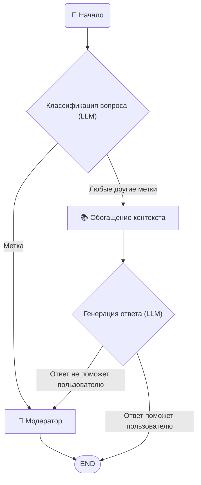

# 🤖 WorkFlow Agent на базе LangGraph, который классифицирует входящие вопросы, обогащает их релевантным контекстом и пытается дать ответ. Если уверенности в ответе недостаточно — запрашивает ручную модерацию.

# 🧠 Как это работает

1. Классификация вопроса (llm_give_question_classifications)
LLM присваивает вопросу одну или несколько категорий от 1 до 5, определяющих тип требуемого контекста.

2. Маршрутизация (route_by_classifications)
Если вопрос получил только метку 5 — он сразу уходит модератору (контекст не требуется или неизвестен).

Иначе — переходит к обогащению контекста.

3. Обогащение контекста (enrich_context)
Для каждой присвоенной метки извлекается соответствующий текстовый контекст из classifications_contexts.

4. Попытка ответа (llm_try_answer)
LLM получает вопрос и полный контекст, генерирует ответ и флаг уверенности (assured_answer).

5. Финальная маршрутизация (route_to_moderator_or_answer)
Ответ уверенный → возвращается пользователю.

Ответ неуверенный → запрос уходит модератору с полной информацией (вопрос, контекст, предварительный ответ).
